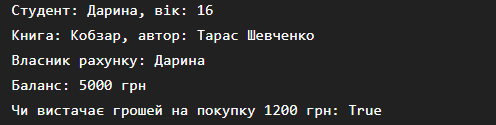

# Самостійна робота №1

## Тема

Базовий синтаксис C# і оголошення класів.

## Мета роботи

Закріпити навички оголошення класів, полів, властивостей та методів у C# для моделювання об'єктів реального світу.

## Хід роботи

1. Створено консольний проєкт `IndependentWork1` у середовищі VS Code за допомогою .NET CLI.
2. Створено три класи:

   * `Student`;
   * `Book`;
   * `BankAccount`.
3. Для кожного класу оголошено приватні поля.
4. Створено публічні властивості для доступу до даних.
5. Додано конструктори для ініціалізації об'єктів.
6. Реалізовано методи для демонстрації поведінки об'єктів.
7. У методі `Main` створено об'єкти всіх трьох класів.
8. Викликано методи класів та виведено результати роботи в консоль.
9. Проєкт перевірено за допомогою команди `dotnet run`.

## Опис класів

### Student

Клас `Student` моделює студента.

Містить:

* приватне поле `_name`;
* приватне числове поле `_age`;
* властивості `Name` та `Age`;
* конструктор;
* метод `PrintInfo()`.

### Book

Клас `Book` моделює книгу.

Містить:

* приватне поле `_title`;
* приватне поле `_author`;
* властивості `Title` та `Author`;
* конструктор;
* метод `PrintInfo()`.

### BankAccount

Клас `BankAccount` моделює банківський рахунок.

Містить:

* приватне поле `_owner`;
* приватне числове поле `_balance`;
* властивості `Owner` та `Balance`;
* конструктор;
* метод `HasEnoughMoney()`, який перевіряє, чи достатньо коштів для покупки.

## Результат роботи програми

```text
Студент: Дарина, вік: 16
Книга: Кобзар, автор: Тарас Шевченко
Власник рахунку: Дарина
Баланс: 5000 грн
Чи вистачає грошей на покупку 1200 грн: True
```

## Висновок

У ході самостійної роботи я закріпила навички створення класів у C#, навчилася використовувати приватні поля, публічні властивості, конструктори та методи. Я створила об'єкти різних класів і продемонструвала їхню роботу в методі `Main`. Також я навчилася перевіряти роботу консольного проєкту за допомогою .NET CLI та зберігати проєкт у GitHub.

