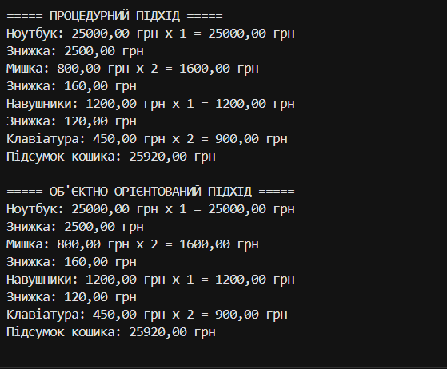

# Самостійна робота №2

## Тема

**Процедурний і об’єктний підходи: порівняння на прикладі**

## Виконав

**Кондратюк Дарина**
Група: **ІПЗ-3/1**

## Мета роботи

Побачити на практиці різницю між процедурним і об’єктним підходами до організації коду, реалізувавши однакову логіку інтернет-магазину двома способами.

## Завдання

У роботі реалізовано обробку кошика інтернет-магазину у двох варіантах:

1. Процедурний підхід.
2. Об’єктно-орієнтований підхід.

Для обох версій використовується однаковий набір товарів.

---

# 1. Процедурний підхід

У процедурній версії дані про товари зберігаються у трьох паралельних масивах:

* назви товарів;
* ціни;
* кількості.

Для обробки даних використовуються окремі методи.

Програма:

* обчислює суму кожної позиції;
* застосовує знижку 10% для товарів, ціна яких перевищує 500 грн;
* підсумовує загальну вартість кошика.

## Недоліки процедурної версії

1. Дані одного товару розподілені між трьома різними масивами.
2. Існує ризик помилки, якщо масиви матимуть різну кількість елементів.
3. Для роботи з товаром потрібно одночасно використовувати кілька масивів та однаковий індекс.
4. При додаванні нової характеристики товару потрібно створювати ще один масив.
5. Логіка роботи з товаром не об'єднана в одну сутність.
6. Повторне використання логіки для іншого кошика або іншої частини програми є менш зручним.

---

# 2. Об’єктно-орієнтований підхід

В об’єктній версії створено два класи:

### Product

Клас `Product` описує товар.

Він містить:

* `Name` — назву товару;
* `Price` — ціну товару.

### Cart

Клас `Cart` описує кошик покупок.

Він містить список товарів із кількістю та має методи:

* `AddItem()` — додає товар до кошика;
* `GetTotal()` — обчислює загальну суму;
* `ApplyDiscount()` — застосовує знижку 10% для товарів дорожчих за 500 грн.

---

# 3. Результат виконання

Для обох версій використано однакові товари:

| Товар      |      Ціна | Кількість |
| ---------- | --------: | --------: |
| Ноутбук    | 25000 грн |         1 |
| Мишка      |   800 грн |         2 |
| Навушники  |  1200 грн |         1 |
| Клавіатура |   450 грн |         2 |

Знижка 10% застосовується до товарів, ціна яких перевищує 500 грн.

Підсумок процедурної версії:

**25920.00 грн**

Підсумок об’єктно-орієнтованої версії:

**25920.00 грн**

Отже, обидві версії виконують однакову бізнес-логіку та дають однаковий результат.

---

# 4. Порівняння підходів

| Процедурний підхід                                  | Об’єктно-орієнтований підхід                                          |
| --------------------------------------------------- | --------------------------------------------------------------------- |
| Дані зберігаються у паралельних масивах             | Дані товару об'єднані у класі `Product`                               |
| Товар не є окремою сутністю                         | Кожен товар є об'єктом `Product`                                      |
| Дані передаються між методами через параметри       | Об'єкти працюють разом через методи класів                            |
| Для додавання характеристики потрібен новий масив   | У `Product` можна додати нову властивість                             |
| Кошик не представлений окремою сутністю             | Є окремий клас `Cart`                                                 |
| Логіку складніше повторно використовувати           | `Cart` можна створювати та використовувати в різних частинах програми |
| Додавання нових операцій потребує роботи з масивами | Нові операції можна додавати як методи `Cart`                         |

## Що змінилося у структурі даних

У процедурній версії один товар описувався трьома окремими значеннями з однаковим індексом у масивах.

В об’єктній версії товар представлений одним об’єктом `Product`, який зберігає свою назву та ціну. Клас `Cart` зберігає товари та їх кількість.

## Додавання нової операції

В об’єктній версії простіше додати нову операцію, наприклад видалення товару з кошика. Для цього можна створити метод `RemoveItem()` у класі `Cart`.

У процедурній версії для цього довелося б окремо змінювати або перебудовувати кілька масивів.

## Повторне використання Cart

Клас `Cart` можна створити в іншому місці програми та використовувати його методи без необхідності передавати окремі масиви назв, цін і кількостей.

---

# 5. Висновок

Під час виконання роботи я побачила практичну різницю між процедурним і об’єктно-орієнтованим підходами. У процедурному варіанті дані про товари зберігаються окремо, що ускладнює їх обробку та розширення програми.

Після переходу до об’єктно-орієнтованого підходу дані та операції були об’єднані у відповідні класи `Product` і `Cart`. Це зробило структуру програми зрозумілішою та спростило можливість її подальшого розширення.

Обидві версії програми використовують однакові вхідні дані та дають однаковий підсумковий результат — **25920.00 грн**.

---

# 6. Скріншот результату

