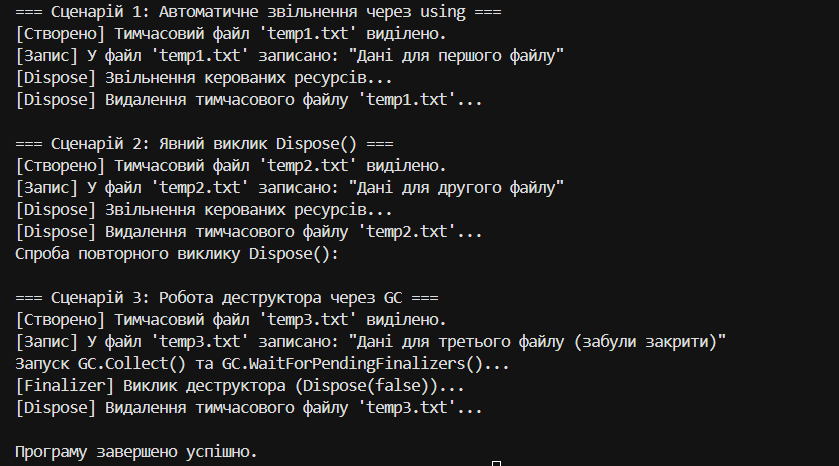

# Самостійна робота №3: Життєвий цикл об’єкта та керування ресурсами

**Студент:** Кондратюк  
**Дисципліна:** Об’єктно-орієнтоване програмування  
**Тема:** Життєвий цикл об’єкта та керування ресурсами.  
**Варіант:** №8 (`TemporaryFile`)  
**Проєкт:** `IndependentWork3v8`  

---

## 📌 Опис проєкту
Консольний додаток C#, що демонструє реалізацію повного патерну **Dispose** та інтерфейсу **IDisposable** для керування некерованими ресурсами на прикладі класу `TemporaryFile`.

Клас `TemporaryFile` імітує роботу з тимчасовим файлом, що потребує обов'язкового очищення (видалення) після завершення роботи з ним.

---

## ⚙️ Структура патерну Dispose у класі `TemporaryFile`
1. **Приватні поля:**
   - `_tempFilePath` (string) — шлях до тимчасового файлу.
   - `_fileExists` (bool) — прапорець виділення ресурсу.
   - `_disposed` (bool) — прапорець перевірки повторного звільнення пам'яті.
2. **Публічні властивості:** `TempFilePath`, `FileExists`.
3. **Конструктор:** ініціалізує та "виділяє" ресурс.
4. **Метод `Write(string content)`:** здійснює запис у файл із перевіркою стану об'єкта.
5. **Захищений віртуальний метод `Dispose(bool disposing)`:** базовий метод патерну, що розділяє очищення керованих та некерованих ресурсів.
6. **Публічний метод `Dispose()`:** викликає `Dispose(true)` та пригнічує фіналізацію через `GC.SuppressFinalize(this)`.
7. **Деструктор `~TemporaryFile()`:** викликає `Dispose(false)` для захисту від витоку ресурсів.

---

## 🚀 Демонстрація роботи в `Main`
У програмі реалізовано 3 основні сценарії:

1. **Сценарій 1 (Конструкція `using`):**  
   Автоматично викликає метод `Dispose()` після виходу з блоку, що гарантує своєчасне звільнення ресурсів.

2. **Сценарій 2 (Явний виклик `Dispose()`):**  
   Демонструє ручний виклик `Dispose()`, а також перевіряє захист від повторного очищення (завдяки прапорцю `_disposed`).

3. **Сценарій 3 (Автоматичне очищення через GC та деструктор):**  
   Демонструє роботу збирача сміття (`GC.Collect()` та `GC.WaitForPendingFinalizers()`), який викликає деструктор `~TemporaryFile()`, якщо розробник забув закрити ресурс вручну.

---

## 📸 Результат виконання програми

---

## 📝 Висновок
Під час виконання роботи було вивчено життєвий цикл об'єктів у .NET та засвоєно патерн Dispose. Конструкція `using` є найбільш надійним інструментом для роботи з ресурсами, оскільки вона гарантує їх звільнення за будь-яких умов. Використання деструктора та `GC.SuppressFinalize()` дозволяє створити страхувальний механізм для некерованих ресурсів без зайвого навантаження на збирач сміття.