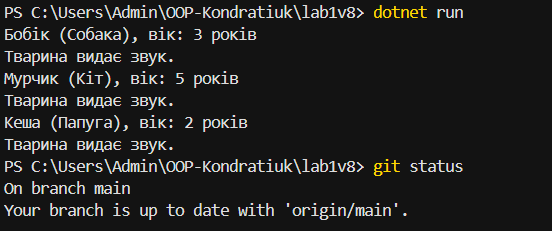

# Лабораторна робота №1

## Тема

Створення першого проєкту. Класи, об’єкти, конструктори та деструктори. Середовище розробки.

## Варіант

8

## Клас

`Animal`

## Поля

* `species` — вид тварини
* `nickname` — кличка тварини

## Властивість

* `Age` — вік тварини

## Метод

* `Speak()` — виводить інформацію про тварину та повідомлення про звук.

## Об'єкти

У програмі створено три об'єкти класу `Animal`:

* Бобік — собака, 3 роки
* Мурчик — кіт, 5 років
* Кеша — папуга, 2 роки

## Середовище розробки

* .NET SDK
* Visual Studio Code
* Git
* GitHub

