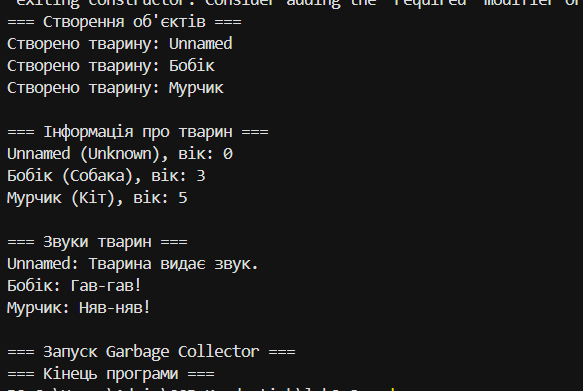

# Звіт з Лабораторної роботи №2
**Тема:** Клас із кількома конструкторами. Життєвий цикл об’єкта.  
**Навчальний заклад:** Рівненський фаховий коледж інформаційних технологій  
**Дисципліна:** Об’єктивно-орієнтоване програмування  
**Варіант:** №8 (Клас `Animal`)  

---

## 🎯 Мета роботи
Навчитися реалізовувати перевантажені конструктори, дослідити порядок їх викликів за допомогою ланцюгового виклику `: this()` та зрозуміти основи життєвого циклу об’єкта в C#.

---

## 🛠️ Виконання роботи

### 1. Створення проєкту
Створено консольний проєкт за допомогою .NET CLI:
```bash
dotnet new console -o OOP-Kondratiuk/lab2v8
