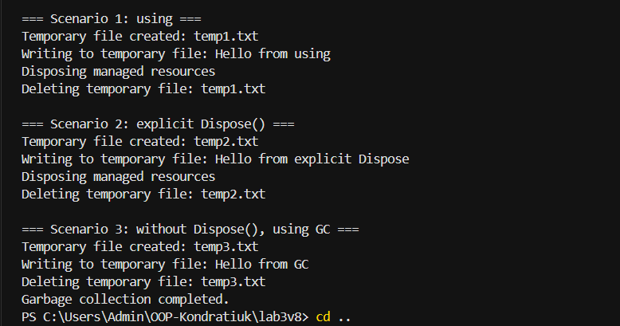

# Лабораторна робота №3

## Тема

**Життєвий цикл об’єкта та керування ресурсами**

## Мета роботи

Поглибити розуміння життєвого циклу об’єкта в C#, навчитися працювати з некерованими ресурсами, реалізувати інтерфейс `IDisposable` та патерн `Dispose`.

## Варіант

**Варіант 8 — клас TemporaryFile**

Клас `TemporaryFile` імітує роботу з тимчасовим файлом.

Поля класу:

* `_tempFilePath` — шлях до тимчасового файлу;
* `_fileExists` — визначає, чи існує тимчасовий файл;
* `_disposed` — визначає, чи був ресурс звільнений.

Метод:

* `Write(string content)` — імітує запис даних у тимчасовий файл.

Метод `Dispose()` видаляє тимчасовий файл та звільняє ресурс.

## Хід роботи

1. Створено консольний проєкт `lab3v8` у репозиторії `OOP-Kondratiuk`.
2. Реалізовано клас `TemporaryFile`.
3. Клас реалізує інтерфейс `IDisposable`.
4. Реалізовано конструктор для створення та імітації виділення ресурсу.
5. Реалізовано метод `Write(string content)`.
6. Реалізовано захищений метод `Dispose(bool disposing)`.
7. Реалізовано метод `Dispose()`.
8. Реалізовано деструктор `~TemporaryFile()`, який викликає `Dispose(false)`.
9. У методі `Main()` продемонстровано три способи звільнення ресурсу:

   * використання `using`;
   * явний виклик `Dispose()`;
   * автоматичне звільнення через деструктор після `GC.Collect()`.

## Код програми

Основний код програми знаходиться у файлі `Program.cs`.

## Результат виконання

Нижче наведено результат роботи програми з трьома сценаріями.

## Контрольні запитання

### 1. Що таке життєвий цикл об’єкта в .NET?

Життєвий цикл об’єкта — це процес від створення об’єкта до його видалення збирачем сміття. Він включає створення, використання, збирання сміття та, за потреби, фіналізацію.

### 2. Яка різниця між керованими та некерованими ресурсами?

Керовані ресурси контролюються середовищем .NET та автоматично звільняються збирачем сміття. Некеровані ресурси потребують явного звільнення, наприклад через `Dispose()`.

### 3. Для чого призначений інтерфейс IDisposable?

`IDisposable` призначений для явного звільнення ресурсів, які не можуть бути повністю звільнені збирачем сміття автоматично.

### 4. Як оператор using допомагає в керуванні ресурсами?

Оператор `using` автоматично викликає метод `Dispose()` після завершення роботи з об’єктом, навіть якщо під час виконання виникла помилка.

### 5. Навіщо в патерні Dispose використовується метод GC.SuppressFinalize()?

`GC.SuppressFinalize(this)` повідомляє збирачу сміття, що фіналізатор об’єкта вже не потрібно викликати, оскільки ресурс був звільнений через `Dispose()`.

### 6. Чому в деструкторі викликається Dispose(false), а в методі Dispose() — Dispose(true)?

`Dispose(true)` використовується при явному звільненні ресурсу та дозволяє звільняти як керовані, так і некеровані ресурси. `Dispose(false)` викликається деструктором і використовується для звільнення некерованих ресурсів.

## Висновок

Під час виконання лабораторної роботи я поглибила знання про життєвий цикл об’єктів у C#. Я навчилася реалізовувати інтерфейс `IDisposable` та патерн `Dispose`, працювати з керованими й некерованими ресурсами. Також я продемонструвала використання `using`, явного виклику `Dispose()` та автоматичного звільнення ресурсу за допомогою деструктора і `GC.Collect()`.
